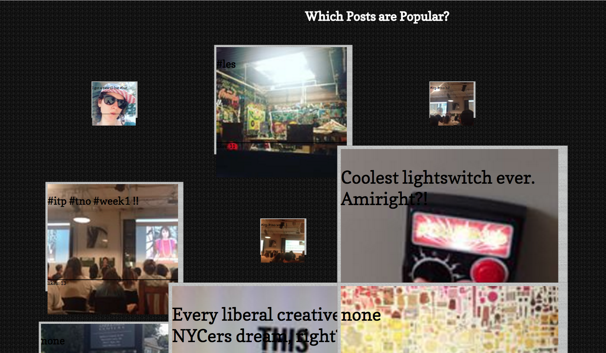

Designing for Data Personalization
==================================

Eve Weinberg's weekly Data Visualization assignments!!!!

### Week1: Find, Create, and Parse personal data about yourself.

Syllabus is available [here](https://github.com/sslover/designing-for-data-personalization/blob/master/syllabus.md)

Javascript cheatsheet is available [here](https://github.com/sslover/designing-for-data-personalization/blob/master/javacript-cheat-sheet.md)
